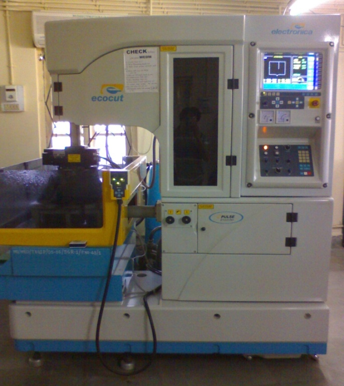
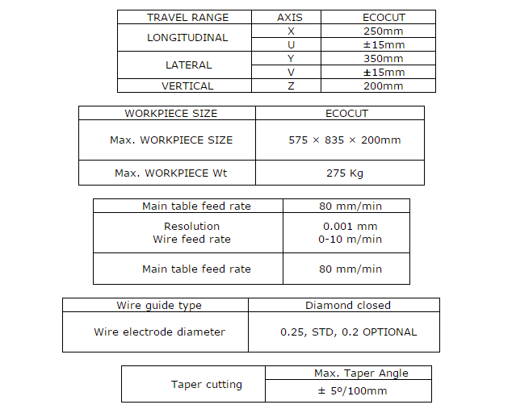

### Procedure

Digram of Wire Electric Discharge Machine

Specifications:

Voltage stabilizers (3 Phase)
1. ECOCUT : 7.5 KVA, @415 V line to line
2. Input voltage : 310 V to 416 V line to line, i.e. 180-270 V/phase
3. Output voltage : 415 V line to line, i.e. 240 V phase to neutral
4. Output voltage regulation : &plusmn; 1%/ phase of output voltage
5. Voltage correction rate : 35 V/ sec
6. Termination : 5 ways socket on rear door (20 A)
7. Overload protection : With SIEMENS contractor and 3 phase thermal overload relay
8. Other protection : Single phasing pre-setter, over-voltage trip

