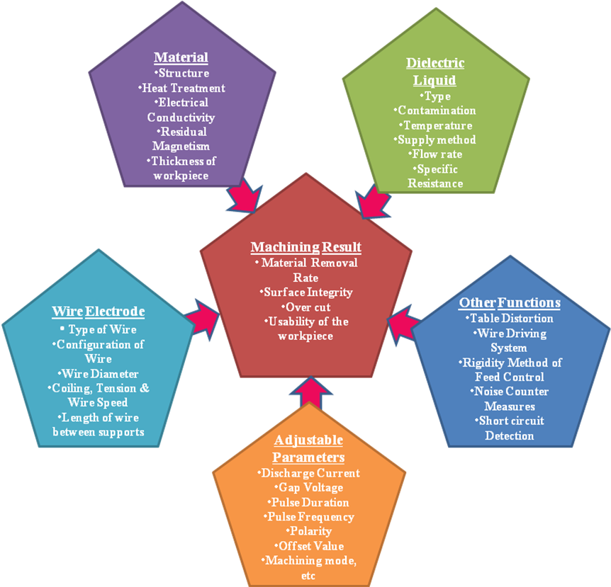

### Theory

Influence of Process parameters on the Wire EDM process:-

The main goal of WEDM manufacturers and users is to achieve a better stability of the process and higher productivity. As newer, more exotic materials are developed, and more complex shapes are presented, conventional machining operations reach their limitations; hence the increased use of WEDM in manufacturing continues to grow at an accelerated rate. Wire electrical discharge machining manufacturers and user emphasize on achievement of higher machining productivity with a desired accuracy and surface finish. However, due to a large number of variables even a highly skilled operator with a state-of the art WEDM is rarely able to achieve the optimal performance.
The optimum utilization of the capacity of WEDM process requires proper selection of machining parameters. This part of literature review aims to investigate the effect of various process parameters on desirable output. WEDM is complex in nature and is controlled by large number of parameter as shown in Figure 1.1.

**Influence of pulse parameter**

In most of the commonly used wire-cut EDM, the pulse on time is the switch-on period of electrical charge to the capacitor bank and the peak current actually the charging current. Before, the capacitor has been charged to the peak voltage, a driving pulse with the preset on and off- time, switches on and off the transistors rapidly. Therefore, the gap voltage proceeds towards the full value step by step. The pulse on time, peak current and the capacitance determine the number of steps to reach the peak value. If the on time and peak current are sufficient and the capacitance is small enough, the gap voltage can take only one step to jump to the peak value.

Figure 1.1 Factors Influencing the Wire EDM process [2]

**ii. Effect of Frequency**

The total period of charging process is controlled by the four pulse parameters, namely, pulse on time, pulse off time (pulse frequency), capacitance and peak current. The actual average sparking frequency can be determined by the preset values of pulse on time, frequency, peak current, capacitance, and servo reference voltage. When other parameters are kept at constant values, lower servo voltage generates higher sparking rate (multi sparking) and short circuit frequencies, and vice versa. Commonly used pulsing circuit is represented in Figure 1.2.

As illustrated in Figure 1.3, increased discharge frequency can improve the surface finish within limits, by doubling the amperage and frequency; the metal removal rate will double without changing the finish [2]. At high frequencies, the amperage is reduced due to inductance, thereby reducing the MRR. The economics involved therefore sets practical limit on surface finish. The relationship between current, frequency on surface finish is shown in Figure 1.4.

**iii. Influence of Wire Positioning** Trezise [12] concluded that the fundamental limit on machining accuracy is due to the dimensional consistency of the wire, and the positional accuracy of worktable. However, other factors conspire to prevent this theoretical precision from being achieved. Most of the uncertainties arise because the working region is an unsupported section of the wire, remote from the guides. It is necessary to hold the wire in a designated position against the object because the wire repeats complex oscillations due to electrical discharge between wire and the work piece. It may also be noted that the unsupported length of wire changes with thickness of the job jeopardizing the wire vibration frequency. The computer controlled positioning system constantly maintains the gap between the wire and the work piece. Disturbances from the external and internal sources generate vibrations in the wire, which ultimately influence the repetitive sparking process in spite of the controlled positioning system. This deviation of the electrode from its mean position therefore has considerable influence on the occurrence of the next discharge. It also influences the breakdown voltage of the discharge and the discharge energy since the gap is changing continuously during the vibration.

It was reported by Masuzawa [6] that the amplitude of the vibrations can easily reach 10μm or more, and cannot be neglected. Most commercial machines are specially designed for rigidity to minimize the tool deflection, even though it is not possible to completely eliminate the influences, which tend to displace the wire from its mean position.

**iv. Effect of Wire Tension**

Within considerable range, an increase in wire tension significantly increases the cutting speed and accuracy. The higher tension decreases the wire vibration amplitude and hence decreases the cut width so that the speed is higher for the same discharge energy. However, if the applied tension exceeds the tensile strength of the wire, it leads to wire breakage (Figure 1.5). Moreover excessive amplitude of equivalent to the spark gap length might cause short-circuit.

Jeenes et.al [3] found relation between the wire vibrations and occurrence of short circuits, resulting in lower cutting speeds and an increased possibility of wire rupture. The reasons shown above suggest the necessity for controlling the machine parameters in order to minimize the effects of the disturbances.

**v. Effect of Wire Material Composition**

A desirable wire material for WEDM electrode should posses following properties:

* Adequate tensile strength with high fracture toughness
* High electrical conductivity [% IACS - International Annealed Copper Standard, a unit of electrical conductivity for metals and alloys relative to a standard annealed copper conductor; an IACS value of 100% refers to a conductivity of 5.80 x 107 siemens per meter (58.0 MS/m)].
* Good flushing ability
* Low melting point and Low energy requirement to melt and vaporize [2].

Sho et al. [11] reported that the machining rates increase with increase in Zn content in the wire. Higher the Zn content allows lower servo voltage (mean machining voltage), thereby making short circuiting difficult. The machining is known to increase with the increase in Zinc content. This is because of cooling due to zinc evaporation and also because the ZnO coating on the surface helps to prevent short circuits. Copper or brass core wires, coated with a Zinc or ZnO layer of 20-30μm thickness, when used increase the cutting speed. The evaporation of the zinc coating produces a ‘heat-sink’ effect in the wire and thus cooling the core material [10]. This ‘heat-sink’ effect on the wire results in the improvement of the efficiency of the WEDM process by reducing the wire temperature, and therefore allowing a more thermal flow, leading to an increase of the cutting speed by up to 50% [1], whilst due to evaporation of coating, the gap increases leading to better dielectric flushing, and debris removal. It also stabilizes the plasma column of spark. Research has also been conducted to improve the technology of the tool by overcoming the thermal effects to prevent the wire from breaking during the process. Different wire composition would determine their final performance.

**vi. Effect of Work Piece Material**

Researchers [2,5,9] have also communicated that specific physical, metallurgical, and electrical properties of the work piece material also influence the process. These properties include how well the metal is polished, its magnetic condition, and how the metal was removed from the heat treatment process when it was produced. One must also consider the phenomenon of expansion and contraction according to the temperature of the material. For material processed by EDM or WEDM, the initial surface condition affects the results.
A low melting point in the material increases the MRR and improper heat treatment of the metal results in distortion, breakage of the die and punches while machined by WEDM. As for example, Kim and Jeong [4] carried out WEDM tests on various cemented carbides with different percentage of cobalt present in WC [GT 10 (6% Co), GT 20 (12% Co), GT 30 (15% Co)] and found out that the percentage of cobalt has an influence on the speed of erosion. A high Co-content worsens the final surface quality as a greater quantity of solidified metal deposits on the eroded surface.

**vii.Effect of the Thickness of the Work Piece**

In the WEDM process, cutting speed decreases as the thickness of the work piece increases. Normally, WEDM uses a transistor controlled capacitor circuit in which the cutting speed is controlled by a capacitor value. When using a fixed capacitor to machine a thicker work piece, the cutting speed is decreased.
Hatchek [2] reported that the thicker the work piece, the faster is the cut, all other factors being equal. In any EDM operation, every pulse does not produce a spark. However, the longer length of wire electrode in a thicker work piece provides more opportunities for the spark to occur. This makes the process more efficient for a thicker work piece.

**viii. Influence of Dielectric**

The dielectric fluid and the flushing thereof perform following functions [2]:
* To insulate the gap before a large amount of energy is accumulated and to concentrate the discharge energy to a small area (insulator).
* To recover a desired gap condition after the discharge by cooling the gap and deionizing (cooling).
* To flush away the debris of the work piece removed by spark (flushing medium).

**x. Flushing Pressure**

The commonly used flushing methods are immersion flushing, spray or jet flushing. Figure 1.6, shows the curve of influence of flushing pressure on machining speed and surface roughness. The cutting performances during roughing cuts have been improved since the removed particles in the machining gap are evacuated more efficiently (the pressure must be reduced during finishing in order to avoid geometrical part errors). It can be seen that when flushing pressure is less than certain pressure value, it is impossible to do any machining. Along with increased flushing pressure the machining speed also increases, but when it is over 1 kg/cm2 (98066.5Pa), the increased trend slows down while the surface roughness improves gradually with increased flushing pressure; due to effective removal of debris. When flushing pressure is less than 0.3kg/cm2 (29420Pa), high temperature is easily registered along electric discharge area.

**Summary**

From the literature survey carried, it has been observed that process parameters viz, voltage, current and pulse related parameters (viz. pulse on time, pulse off time) are the most important parameters in EDM/WEDM. They along with interaction time (pulse width x frequency) dominate the output parameters viz., MRR, surface roughness, etc. The depth of crater, temperature generated and the resultant surfaces obtained (along with its constituents) are result of pulse energy applied. Various researchers have focused on these aspects and advocated for supply of optimum energy which in turn avoids post process complications/ failures.